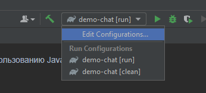
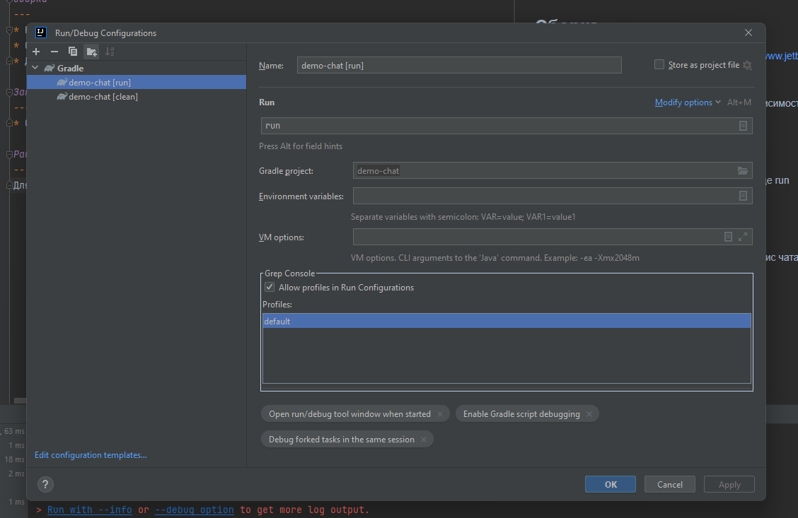

Демо проект по использованию JavaFX.

Сборка
---
* Необходимо скачать IntelliJ IDEA CE - https://www.jetbrains.com/ru-ru/idea/download/download-thanks.html?platform=windows&code=IIC
* Скачать JDK средствами IDE - https://www.jetbrains.com/idea/guide/tips/download-jdk/
  * Необходима 17я версия 
* Далее проект установит все необходимые зависимости

Запуск
---
* Создать Gradle конфигурацию указа в команде *run*

* Запустить задачу - приложение собереться и запуститься.
  * Для работы необходимо локально запустить сервис чата - https://github.com/ros-tel/chat-server-blank